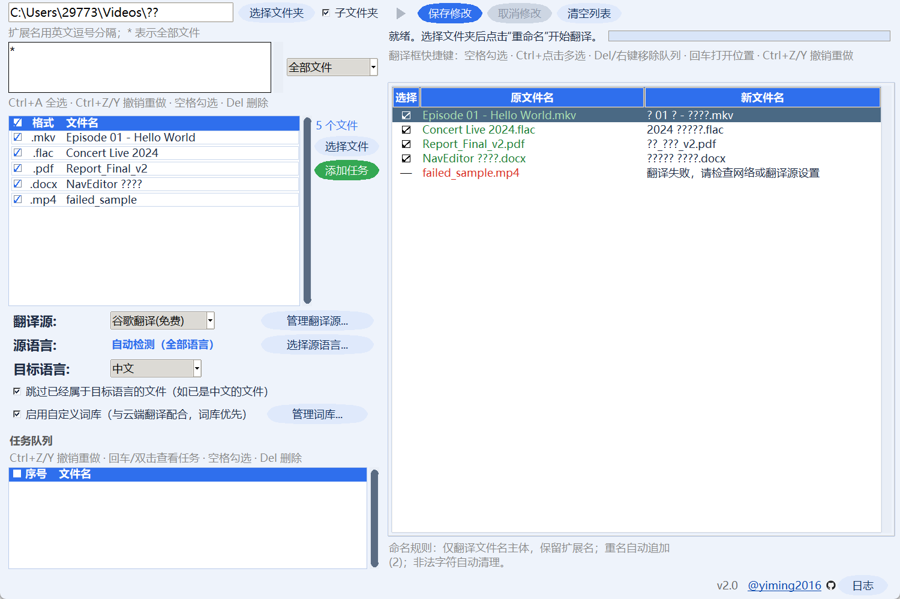
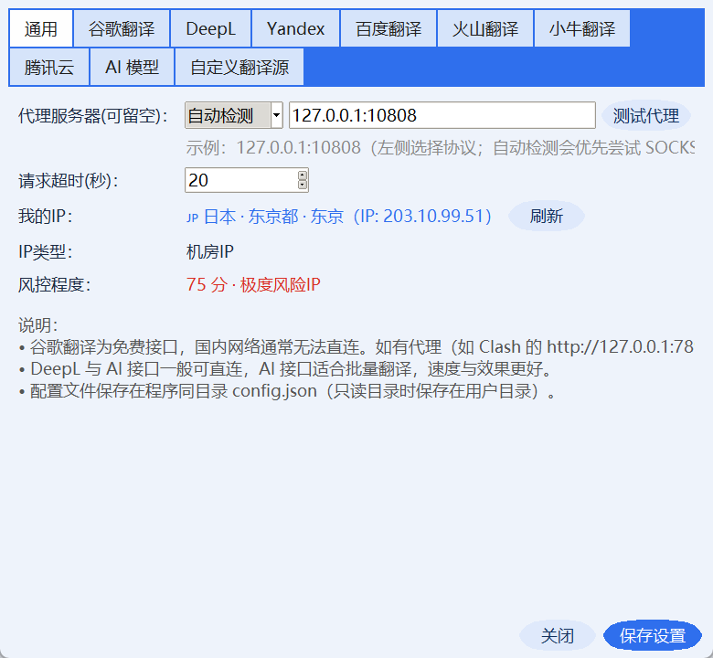

<div align="center">
  
  <h1>文件名翻译器</h1>
  <p><b>批量翻译并重命名文件名</b> 的 Windows 桌面小工具（Python + tkinter）</p>
  <p>
    <a href="https://github.com/yiming2016/File-Name-Conversion">
      
    </a>
    
    
    
  </p>
</div>

---

## 简介

把文件夹或文件的名字批量翻译成目标语言（默认英文 / 日文 / 韩文等 → 中文）。支持多种翻译源、AI 模型、自定义 HTTP 翻译接口和自定义词库；翻译结果在界面中逐条预览、勾选、修改，确认后统一重命名，并支持一键撤销 / 重做。

## 功能特性

### 🌐 翻译源

- **谷歌翻译**：免费，无需 Key
- **DeepL**：官方 API（免费版 / 专业版），界面提供“自动获取 API Key”
- **Yandex**：官方 API
- **百度翻译 / 火山翻译 / 小牛翻译 / 腾讯云**：国内翻译源，填密钥即可
- **AI 模型**：任意 OpenAI 兼容接口（DeepSeek、OpenAI、通义千问、智谱、Kimi、本地 Ollama 等），只需填接口地址 + Key + 模型名；模型名是下拉框，可直接输入或点“获取模型列表”自动读取该接口正在服务的模型，并支持一键查询 API Key 余额
- **自定义翻译源**：任意 HTTP 接口（URL / 请求头 / 请求体 / 响应路径均可配置），内置 MyMemory 免费示例

### 🌍 语言设置

- 源语言支持**多选**（英文、日文、韩文……可同时勾选），也可选择“自动检测（全部语言）”
- 目标语言几十种：中文（默认）、英文、日文、韩文……
- 可勾选“跳过已经属于目标语言的文件”（例如目标为中文时，已是中文的文件名不会被翻译）

### 📚 自定义词库 + 云端翻译

- **手动词条**（原文 → 译文）：翻译时词条优先——先把原文替换成占位符，云端翻译完成后再还原成词库译文，保证专有名词不被乱翻
- 三种匹配方式：子串匹配、整词匹配（按英文单词边界）、正则表达式（支持 `\1` 引用捕获组）
- 译文与原文相同表示“保留原名”（如乐队名 Deep Purple → Deep Purple）
- **词库文件目录** `词库/`：按格式分子文件夹 `tsv/ tbx/ tmx/ json/ csv/ txt/`，支持六种格式（TMX / TBX 自动提取双语词对，单列词表按“保留原文”处理），勾选即可启用
- 词库文件以三级树形显示（格式 > 文件夹 > 文件），鼠标滚轮和右侧滚动条均可查看
- 默认内置两个 GitHub 词库项目（可在“管理词库 → 词库文件”中勾选 / 取消）：
  - [LDNOOBW/List-of-Dirty-Naughty-Obscene-and-Otherwise-Bad-Words](https://github.com/LDNOOBW/List-of-Dirty-Naughty-Obscene-and-Otherwise-Bad-Words)（txt，29 种语言）
  - [LDNOOBW/naughty-words-js](https://github.com/LDNOOBW/naughty-words-js)（json，28 种语言）

### 🖥️ 图形界面

- 选择文件夹**或文件**（可多选），支持包含子文件夹、按扩展名过滤（视频 / 音频 / 图片 / 文档预设或自定义）
- **任务队列**：可添加多个翻译任务，双击任务查看 / 编辑任务内容
- **翻译框逐条预览**：成功行原文件名为绿色、失败行为红色；双击“新文件名”可直接修改（修改后变绿）；空格勾选 / 取消，Del 或右键移除队列，支持 Ctrl+Z / Ctrl+Y 撤销重做、Ctrl+点击多选
- 批量重命名（自动处理重名冲突）、一键撤销上次重命名、重做
- 翻译记录自动写入文件夹下的 `重命名记录.log`
- 设置窗口“测试翻译”成功后对应页签变绿、失败变红；获取 API Key 的网址可直接点击用浏览器打开
- 代理支持 HTTP / SOCKS5 手动选择（如 `127.0.0.1:10808`），并显示当前 IP、IP 类型与风控程度
- 彩色 UI：蓝色主题横幅、圆角按钮、彩色页签、OnlyFans 风格 Logo

## 截图





## 快速开始

### 直接使用（推荐）

下载 [文件名翻译器.exe](文件名翻译器.exe)，双击即可运行，无需安装 Python。把整个文件夹（exe + 词库）复制到任意 Windows 电脑即可使用。

### 从源码运行

需要 Python 3.8+：

```bat
git clone https://github.com/yiming2016/File-Name-Conversion.git
cd File-Name-Conversion
pip install -r requirements.txt
python main.py
```

### 打包成 exe

双击 `build_exe.bat`，或手动执行：

```bat
python -m PyInstaller --noconfirm --clean --onefile --windowed --name "文件名翻译器" --icon logo.ico --distpath "..\成品-打开即用" --workpath build --specpath . main.py
```

## 使用方法

1. 选择文件夹（或点“选择文件”添加具体文件），可选“子文件夹”与扩展名过滤
2. 点“添加任务”把文件加入任务队列（可添加多个任务）
3. 选择翻译源、源语言、目标语言，按需勾选“启用自定义词库”
4. 点击播放按钮开始翻译，在右侧翻译框中勾选 / 取消要重命名的文件，可双击修改新文件名
5. 点“保存修改”生效，之后可随时“取消修改”回滚

## 常见问题

- **谷歌翻译提示请求失败 / 超时**：国内直连谷歌通常不通。在“管理翻译源 → 通用”填入本地代理（如 `127.0.0.1:10808`，不带 `http://` 会自动补全），或改用 DeepL / AI 接口。
- **DeepL 报“未配置 API Key”**：到 [DeepL API](https://www.deepl.com/zh/pro-api) 注册，把 Key 填进“管理翻译源 → DeepL”，或直接点“自动获取 API Key”。
- **AI 接口怎么填**：选择预设（DeepSeek / 通义千问等）会自动填好接口地址和模型名，只需填 API Key；本地 Ollama 可留空 Key。
- **自定义翻译源怎么配**：以 MyMemory 为例——URL 填 `https://api.mymemory.translated.net/get?q={text}&langpair={source}|{target}`，响应路径填 `responseData.translatedText`；支持 `{text}` `{source}` `{target}` 占位符，POST 请求可在“请求体”填 JSON 模板。
- **词库怎么用**：勾选主界面“启用自定义词库”，点“管理词库...”添加词条。例如想让 `NavEditor` 固定翻译成“导航编辑器”，添加原文 `NavEditor`、译文 `导航编辑器`；想让某个词完全保留，译文填与原文相同的词即可。
- **词库文件怎么用**：把词库文件按格式放进 `词库/` 下对应文件夹（如 `词库/json/`），在“管理词库 → 词库文件”勾选启用。
- **配置文件**：保存在 exe / 脚本同目录的 `config.json`，删除后恢复默认设置。

## 项目结构

```
.
├─ 成品-打开即用\          打开即用版本：exe + 词库 + 使用说明
│   ├─ 文件名翻译器.exe
│   ├─ 词库\               按格式分文件夹（tsv / tbx / tmx / json / csv / txt）
│   └─ config.json         运行配置（首次运行自动生成）
└─ 开发源码\              源码与打包脚本
    ├─ app\                GUI / 翻译引擎 / 核心逻辑 / 词库解析
    ├─ main.py             程序入口
    ├─ build_exe.bat       一键打包 exe
    └─ requirements.txt
```

## 许可证

[MIT](LICENSE) © 2026 刘一鸣
